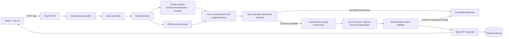

# MarketBrief AI — Auditable Stock-News RAG Assistant

MarketBrief AI is a closed-book Retrieval-Augmented Generation (RAG) application for answering questions about an indexed stock-news corpus. It is designed to prioritize grounding, citation accuracy, financial safety, and auditability rather than unrestricted market commentary.

The application uses a React frontend, a FastAPI backend, hybrid dense and lexical retrieval, Azure OpenAI or OpenAI generation, deterministic citation validation, and SQLite audit logging.

## Key capabilities

- Answers only from the indexed article corpus.
- Uses hybrid retrieval: semantic dense search plus BM25 exact-term search.
- Produces inline article citations in the form `[ARTICLE_ID]`.
- Rejects answers containing citations outside the retrieved evidence set.
- Abstains when evidence is missing or generated claims are not properly cited.
- Detects buy, sell, hold, price-target, and similar recommendation intent.
- Returns a financial-safety notice rather than personalized investment advice.
- Logs the full response path for later audit and debugging.
- Includes a React user interface, REST API, evaluation dataset, Docker support, and automated tests.

## Architecture



## End-to-end request flow

1. The frontend sends a question to `POST /ask`.
2. The backend normalizes and classifies the question.
3. Guardrails detect recommendation intent and prompt-injection signals.
4. The retriever searches the indexed chunks through two channels:
   - dense semantic similarity;
   - BM25 lexical matching.
5. The scores are normalized and fused using configurable weights.
6. The system keeps the highest-scoring evidence while limiting repeated chunks from one article.
7. If no evidence meets the minimum score, the system abstains.
8. Otherwise, the retrieved context is passed to the selected LLM through a closed-book prompt.
9. The generated answer is checked against the exact retrieved article allow-list.
10. The typed response, retrieval evidence, safety flags, token usage, latency, and validation warnings are written to SQLite.


## Technology stack

| Layer | Technology |
|---|---|
| Frontend | React 19, Vite, Tailwind CSS, Lucide icons |
| Backend API | FastAPI, Uvicorn, Pydantic |
| Workflow | LangGraph deterministic state workflow |
| Dense retrieval | Sentence Transformers and Chroma |
| Lexical retrieval | Local BM25 implementation |
| Generation | Azure OpenAI, OpenAI, or extractive smoke-test mode |
| Audit storage | SQLite |
| Evaluation | Python CLI, JSON dataset, Markdown and JSON reports |
| Packaging | Docker, Docker Compose, Makefile |

## Project structure

```text
stock-news-rag-professional/
├── backend/
│   ├── app/
│   │   ├── api.py              # FastAPI endpoints
│   │   ├── config.py           # Environment and runtime settings
│   │   ├── ingestion.py        # Article loading and chunking
│   │   ├── embeddings.py       # Sentence-transformer or hashing embeddings
│   │   ├── store.py            # Chroma or in-memory corpus store
│   │   ├── retrieval.py        # Dense + BM25 retrieval and fusion
│   │   ├── prompts.py          # Closed-book system and user prompts
│   │   ├── llm.py              # Azure OpenAI, OpenAI, and extractive generators
│   │   ├── guardrails.py       # Financial recommendation and injection checks
│   │   ├── validation.py       # Citation and paragraph-level grounding checks
│   │   ├── workflow.py         # Deterministic RAG workflow
│   │   ├── audit.py            # SQLite audit logging
│   │   ├── evaluation.py       # Evaluation runner and metrics
│   │   └── cli.py              # Index, ask, and evaluate commands
│   └── tests/
├── frontend/
│   └── src/App.jsx             # Chat interface and source cards
├── data/
│   ├── articles/               # Source article files
│   ├── chroma/                 # Generated vector index
│   └── audit.db                # Generated audit database
├── eval/
│   ├── questions.json          # Evaluation questions
│   └── results/                # Generated evaluation reports
├── scripts/
├── .env.example
├── Makefile
└── docker-compose.yml
```

## Prerequisites

- Python 3.11 or later
- Node.js 20 or later; Node.js 22 is recommended
- npm
- Azure OpenAI credentials, an OpenAI API key, or extractive smoke-test mode

## Setup

### 1. Extract and enter the project

```bash
cd stock-news-rag-professional
```

### 2. Create the environment file

```bash
cp .env.example .env
```

Do not commit `.env`. It can contain API keys.

### 3. Configure the LLM provider

#### Azure OpenAI

The code currently defaults to `azure_openai`.

```dotenv
LLM_PROVIDER=azure_openai
AZURE_OPENAI_ENDPOINT=https://YOUR-RESOURCE.openai.azure.com/
AZURE_OPENAI_API_KEY=YOUR_KEY
AZURE_OPENAI_DEPLOYMENT=YOUR_DEPLOYMENT_NAME
AZURE_OPENAI_API_VERSION=2024-10-21
```

`AZURE_OPENAI_DEPLOYMENT` must be the deployment name configured in Azure, not only the base model name.

#### OpenAI

```dotenv
LLM_PROVIDER=openai
OPENAI_API_KEY=YOUR_KEY
OPENAI_MODEL=gpt-5-mini
```

#### Local dependency-light smoke mode

```dotenv
LLM_PROVIDER=extractive
VECTOR_BACKEND=memory
EMBEDDING_BACKEND=hashing
```

Smoke mode validates the mechanics of ingestion, retrieval, citation handling, API responses, evaluation, and auditing. It is not a substitute for semantic retrieval and LLM answer-quality testing.

### 4. Install backend and frontend dependencies

Recommended automated setup:

```bash
./scripts/bootstrap.sh
```

Equivalent manual setup:

```bash
python3.11 -m venv .venv
source .venv/bin/activate
python -m pip install --upgrade pip
python -m pip install -e "./backend[rag,dev]"

cd frontend
npm install
cd ..
```

On Windows PowerShell, activate the environment with:

```powershell
.venv\Scripts\Activate.ps1
```

## Add or replace the news corpus

Place supported files under:

```text
data/articles/
```

Supported formats:

- `.json`
- `.txt`
- `.md`

### Preferred JSON format

```json
{
  "articles": [
    {
      "id": "ART_001",
      "title": "Example headline",
      "source": "Example source",
      "url": "https://example.com/article",
      "published_at": "2026-08-01T08:00:00Z",
      "tickers": ["EXM"],
      "body": "Full article text"
    }
  ]
}
```

Article IDs must be unique and stable because they are used in inline citations, evaluation results, and audit records.

For `.txt` and `.md` files, the first line is treated as the title and the filename becomes the article ID after safe normalization.

## Ingest and chunk the articles

Activate the virtual environment first:

```bash
source .venv/bin/activate
```

Then build or rebuild the corpus index:

```bash
make index
```

Equivalent command:

```bash
cd backend
../.venv/bin/python -m app.cli index --input ../data/articles
cd ..
```

The command:

1. loads the articles;
2. normalizes their text;
3. splits them into overlapping word chunks;
4. creates embeddings;
5. rebuilds the Chroma collection;
6. creates a corpus version from stable chunk IDs and article hashes.

Re-run ingestion whenever the corpus changes.

## Why 220-word chunks and a 40-word overlap?

The active defaults in `backend/app/config.py` are:

```dotenv
CHUNK_SIZE_WORDS=220
CHUNK_OVERLAP_WORDS=40
```

A 220-word chunk is large enough to preserve the local context that financial news commonly needs: the reported result, comparison period, management explanation, market reaction, and related figures often appear within a few nearby paragraphs. Smaller chunks can separate a number from the company, period, or reason it describes. Much larger chunks increase prompt cost and may introduce irrelevant facts into retrieval.

A 40-word overlap is about 18% of the chunk size. It protects facts that cross a chunk boundary, such as a sentence introducing an earnings result followed by a sentence explaining the reason. The overlap is intentionally moderate: enough for continuity without duplicating too much text in the vector store or LLM context.

These values are practical defaults, not universal constants. They should be tuned using retrieval recall, citation precision, latency, and token-cost measurements on the final article set.

## Retrieval configuration

Current defaults:

```dotenv
DENSE_K=8
LEXICAL_K=8
FINAL_TOP_K=5
MAX_CHUNKS_PER_ARTICLE=2
DENSE_WEIGHT=0.60
LEXICAL_WEIGHT=0.40
MIN_RETRIEVAL_SCORE=0.15
```

Dense retrieval helps with paraphrased questions and semantic similarity. BM25 is valuable for exact financial details such as ticker symbols, company names, percentages, currency values, dividend amounts, and regulatory terms.

The 60/40 weighting gives semantic matching the larger role while preserving strong exact-match behavior. Limiting the final context to five chunks and at most two chunks per article controls token use and prevents one long article from dominating the answer.

## Run the backend

From the project root:

```bash
make api
```

Equivalent command:

```bash
cd backend
../.venv/bin/uvicorn app.api:app --reload --host 0.0.0.0 --port 8000
```

Useful URLs:

- Health: `http://localhost:8000/health`
- Swagger API documentation: `http://localhost:8000/docs`

If port 8000 is already in use:

```bash
lsof -i :8000
kill <PID>
```

Or run on another port:

```bash
cd backend
../.venv/bin/uvicorn app.api:app --reload --host 0.0.0.0 --port 8002
```

When changing the backend port, also set the frontend API URL, for example:

```bash
VITE_API_BASE_URL=http://localhost:8002 npm run dev
```

## Run the frontend

Open a second terminal from the project root:

```bash
make ui
```

Equivalent command:

```bash
cd frontend
npm run dev
```

Open:

```text
http://localhost:5176
```

The UI displays the answer, confidence, latency, safety note, and retrieved source cards. It also supports starting a new chat and exporting the visible conversation.

## Quick API test

### Health check

```bash
curl http://localhost:8000/health
```

### Ask a question

```bash
curl -X POST http://localhost:8000/ask \
  -H "Content-Type: application/json" \
  -d '{
    "question": "Why did the EGX30 rise and how did banking stocks perform?",
    "debug": true
  }'
```

## Evaluation

Run the checked-in evaluation dataset:

```bash
make eval
```

Outputs:

```text
eval/results/evaluation_results.json
eval/results/evaluation_report.md
```

The evaluation covers:

- answerability and abstention behavior;
- citation recall;
- citation precision;
- keyword coverage;
- unsupported or unexpected citations;
- answers returned without citations;
- responses to intentionally unanswerable questions.

The deterministic metrics are useful for regression testing, but they do not replace manual review of factual accuracy, relevance, tone, and financial safety.

## Guardrails against misleading financial recommendations

A production-safe design should use multiple layers rather than relying on one prompt.

### Implemented controls

1. **Closed-book evidence boundary:** the prompt instructs the model to use only retrieved articles and not live market data, external knowledge, assumptions, or unsupported predictions.
2. **Recommendation-intent detection:** the input guardrail detects language such as “should I buy,” “sell,” “hold,” “price target,” “portfolio allocation,” and “guaranteed return.”
3. **Safety response:** recommendation intent adds a clear notice that the system summarizes supplied news and does not provide personalized investment advice, a trade instruction, or a price target.
4. **Grounded citations:** factual paragraphs must contain inline article citations.
5. **Citation allow-list:** the validator rejects any citation not present in the retrieved evidence set.
6. **Fail-closed behavior:** missing citations, uncited factual paragraphs, invalid article IDs, or insufficient retrieval lead to a controlled abstention rather than an apparently confident answer.
7. **Confidence and insufficiency fields:** the API exposes whether evidence was insufficient and uses a constrained confidence label.

### Additional production controls

- Add a dedicated output policy classifier for explicit trade instructions, return guarantees, personalized suitability language, and unsupported forecasts.
- Block or rewrite outputs that convert news summaries into buy, sell, hold, target-price, or portfolio-allocation recommendations.
- Separate factual summaries from clearly attributed analyst opinions and company statements.
- Require stronger evidence thresholds for predictive questions than for factual extraction.
- Add human review for high-risk enterprise use cases.
- Continuously evaluate adversarial prompts, citation correctness, recommendation leakage, and abstention quality.
- Display a prominent product-level disclaimer and scope statement in the UI.

The core principle is that the system may summarize what an article or named analyst states, but it should not transform that evidence into its own personalized financial recommendation.

## Auditability: what is logged for every response?

Each response is stored in the SQLite `response_audit` table with:

- unique request ID and UTC timestamp;
- optional session ID;
- normalized user question;
- final answer;
- returned citations;
- retrieved chunks and retrieval scores;
- recommendation-intent flag;
- prompt-injection signal;
- insufficient-evidence flag;
- confidence label;
- model or deployment name;
- prompt version;
- corpus version;
- input and output token counts;
- estimated cost;
- end-to-end latency;
- validation warnings;
- error details when a request fails.

This supports later reconstruction of which corpus version, evidence, prompt, model, and safety decisions produced a given answer. In production, secrets and unnecessary personal data should never be logged, access should be role-based, records should have a retention policy, and tamper resistance should be added through append-only storage or signed event hashes.

## Token cost at 10,000 queries per day

The design makes one generation call per answerable query and uses deterministic validation instead of a second judge-model call. This is important because model cost scales with both prompt and completion tokens.

Let:

- `I` = average input tokens per query;
- `O` = average output tokens per query;
- `Pi` = input price per one million tokens;
- `Po` = output price per one million tokens.

Daily cost is approximately:

```text
10,000 × ((I × Pi / 1,000,000) + (O × Po / 1,000,000))
```

For an illustrative workload of 2,000 input tokens and 250 output tokens per query:

```text
Daily input tokens  = 20,000,000
Daily output tokens =  2,500,000
Daily model cost    = (20 × Pi) + (2.5 × Po)
Monthly model cost  ≈ 30 × daily model cost
```

Use the current provider prices and the real token averages from the audit database rather than hard-coding an estimate.

### One primary optimization

Reduce the context sent to the model while preserving retrieval recall. The current design already limits the final context to five chunks and two chunks per article. At scale, tune `FINAL_TOP_K`, chunk size, retrieval threshold, and duplicate removal using the evaluation set. Even a 25% reduction in average input tokens produces roughly a 25% reduction in input-token spend.

Other useful optimizations include caching repeated question-and-corpus combinations, routing simple extraction questions to a smaller model, summarizing oversized chunks before generation, and avoiding an LLM call for greetings or unsupported questions.

## Audit and cost configuration

Set current model prices in `.env` so the application can estimate cost per response:

```dotenv
INPUT_COST_PER_MILLION=0
OUTPUT_COST_PER_MILLION=0
```

Replace zero with the current rates for the exact provider and deployed model.

## Tests

```bash
make test
```

The backend tests cover core ingestion, retrieval, workflow, validation, API, and evaluation behavior.

## Docker

```bash
docker compose up --build
```

Confirm that the required environment variables are available to the backend container and that the frontend is configured with the correct API base URL.

## Security notes

- Never commit `.env`, API keys, or production audit databases.
- Treat article content as untrusted input; instructions inside an article must not override the system prompt.
- Restrict CORS origins in production.
- Add authentication, authorization, rate limiting, and request quotas before public deployment.
- Encrypt sensitive logs at rest and in transit.
- Keep prompt, corpus, deployment, and evaluation versions traceable.

## Common commands

```bash
make setup     # Create environment and install dependencies
make index     # Ingest, chunk, embed, and index the articles
make api       # Start FastAPI on port 8000
make ui        # Start React/Vite on port 5173
make test      # Run backend tests
make eval      # Run evaluation dataset
make docker    # Start with Docker Compose
make clean     # Remove generated local dependencies and data
```

## Limitations

- The system answers only from the indexed corpus and is not a live market-data service.
- Recommendation-intent detection is pattern-based and should be supplemented with a robust policy classifier in production.
- Confidence is a constrained application label, not a calibrated probability.
- Retrieval thresholds and chunk settings require tuning on the final corpus.
- Deterministic citation validation verifies citation membership and placement; it does not by itself prove that every sentence semantically follows from the cited text.

## Summary

MarketBrief AI demonstrates a practical, auditable RAG architecture for financial-news research. Its main design choice is to keep the workflow controlled: retrieve evidence, generate once, validate deterministically, abstain when grounding fails, and record the complete decision path for later review.

## Resulted Questions 

Question 1 : who are you
Answer 1: I am a closed-book stock-news research assistant. I retrieve relevant evidence from the indexed article collection, generate a concise answer from that evidence only, validate its citations, and log the request for auditability.

Question 2: Why did the EGX30 index close higher, and what role did banking stocks play in the rally?
Answer 2:  The EGX30 index closed higher, rising 1.8%, largely due to strong gains in banking stocks such as Commercial International Bank and QNB Alahli. These banks posted notable increases of 3.2% and 2.1%, respectively. The rally was attributed to expectations that the Central Bank of Egypt would keep interest rates unchanged at its upcoming meeting, which eased concerns about pressure on bank profit margins. Overall, banking stocks were the key drivers of the index's upward movement during this session [EGX30-Higher-Close-for-Banking-Stocks-Lead-Gains_ART_01].

Question 3: What factors contributed to Eastern Tobacco's improved quarterly profitability and margin expansion?
Answer 3: Eastern Tobacco's improved quarterly profitability and margin expansion were driven by higher domestic cigarette prices, stable export volumes to Gulf markets, cost-control measures, and a favorable currency environment. These factors led to an 18% increase in revenue and a rise in gross margin from 29% to 34% compared to the previous year, contributing to a 22% growth in net profit for the quarter. [Eastern-Tobacco-Report-Quartely-Earning_ART_02]

Question 4: How does NileTech plan to use the proceeds from its planned IPO, and what are its expansion objectives?
Answer 4 : NileTech intends to use the proceeds from its planned IPO on the Egyptian Exchange, which aims to raise around EGP 800 million, primarily for expanding its operations into Saudi Arabia and the UAE. Additionally, the company plans to allocate a portion of the funds toward upgrading its technology infrastructure to support further growth and development in its payments and digital lending business lines. These objectives reflect NileTech's strategy to broaden its regional presence and enhance its technological capabilities following the IPO offering, which is pending regulatory approval. [Fintech-Startup-NileTech-Files-for-EGX-IPO_ART_03]

Question 5: What factors supported the recent stabilization of the Egyptian pound, and what monetary policy expectation is highlighted in the article?

Answer 5: The recent stabilization of the Egyptian pound near EGP 48.5 to the US dollar was supported by improved foreign currency inflows from tourism revenue and remittances, as well as a rise in the Central Bank of Egypt's foreign reserves, which increased to $47.2 billion from $45.8 billion over the past three months. The article also highlights that most analysts expect the Central Bank to keep interest rates unchanged at 27.25% during its upcoming monetary policy meeting, reflecting expectations of a steady policy stance in the near term. [Egyptian-Pound-Stabilization-the-Dollar_ART_04]

Question 6: Why are Egyptian real estate developers experiencing margin pressure despite maintaining strong property sales?

Answer 6: Egyptian real estate developers are experiencing margin pressure primarily due to rising construction costs, with steel and cement prices increasing by 12% and 8% respectively over the past quarter. This increase in input costs is compressing profit margins even though property sales remain strong, as companies have reported record pre-sales and substantial year-over-year growth in new sales contracts. The cost inflation in building materials is offsetting the benefits of robust demand and higher sales volumes, leading to reduced profitability for developers despite their sales performance. [Real-Estate-Stocks-Under-Pressure-as-Construction-Costs-Rise_ART_05]

Question 7: Why did Telecom Egypt announce a special dividend, and why did some analysts remain cautious about the announcement?

Answer 7 : Telecom Egypt announced a special dividend of EGP 3.75 per share, funded by proceeds from its recent sale of a minority stake in its data center subsidiary. While this move resulted in a positive reaction from the market, with shares rising 6.1% on the news, some analysts remained cautious. Their caution stemmed from the view that one-off dividends sourced from asset sales do not indicate a long-term increase in regular dividend payments, and thus may not be a reliable signal for future payouts. [Telecom-Egypt-Special-Dividend-Announcement-article_ART_O6]

Question 8: What new obligations do the FRA's draft AI disclosure rules impose on platforms that provide AI-generated investment recommendations?

Answer 8: The FRA's draft AI disclosure rules require platforms providing AI-generated investment recommendations to clearly disclose that these outputs do not constitute licensed financial advice, unless the provider is properly licensed. Platforms must also keep audit logs of AI-generated recommendations for at least five years and introduce human review processes for any recommendations that could significantly impact a retail investor's portfolio. The rules are currently open for public comment before implementation. [FRA-Introduction-for-New-AI-Disclouser-Rules_ART_07]

Question 9: Why do Naeem Brokerage and EFG Hermes disagree on the outlook for Egyptian banking stocks next quarter?
Answer 9: Naeem Brokerage and EFG Hermes disagree on the outlook for Egyptian banking stocks next quarter mainly due to differing expectations about interest rate movements and their effects on bank profitability. Naeem Brokerage takes a more optimistic view, highlighting strong net interest margins and improving asset quality as reasons to rate CIB "Overweight." On the other hand, EFG Hermes maintains a "Neutral" stance, cautioning that a potential interest rate cut later in the year could reduce net interest income despite increasing loan growth. Both firms agree that asset quality has strengthened, but their split is rooted in their contrasting assessments of how changes in interest rates will impact bank margins going forward [Analysts-Split-on-Banking-Sector-Outlook-for-Next-Quarter_ART_08].

Question 10: What do you know about the investment in Apple stock ? Would you recommend for me buying CIB stock price and if yes why ?
Answer 10: The supplied articles provide analysis on CIB (Commercial International Bank) stock but contain no information on Apple stock. Regarding CIB, analysts are divided: Naeem Brokerage rates CIB as 'Overweight' with a price target of EGP 92, citing strong net interest margins and improving asset quality, while EFG Hermes is more cautious with a 'Neutral' rating and a price target of EGP 78, noting concerns that a possible interest rate cut could compress bank margins. Both agree that asset quality at major banks, including CIB, has improved recently. Recent market performance also showed CIB gaining 3.2%, with positive sentiment attributed to expectations that the Central Bank of Egypt will hold rates steady, which could benefit bank margins. Foreign investors have been net buyers of Egyptian equities, including CIB, in recent sessions. However, differing analyst views show that future prospects depend on the Central Bank's rate decisions and the broader economic environment. No recommendation can be made, but these points summarize current analyst outlooks for CIB stock price. [Analysts-Split-on-Banking-Sector-Outlook-for-Next-Quarter_ART_08] [EGX30-Higher-Close-for-Banking-Stocks-Lead-Gains_ART_01]

Question 11: What do you know about the investment in Apple stock
Answer 11: The supplied articles do not provide enough information to answer this question.
